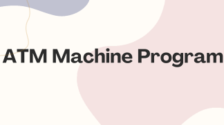

# Basic-ATM-Machine



## About the Project

This project is a desktop application that simulates basic ATM operations. After logging in, users can perform operations such as depositing money, withdrawing money, transferring money to another account, and paying off debts. The project is developed using PyQt5 and written in the Python programming language.

## Features

- **Login System:** Users log in with a username and password.
- **View Balance:** Users can view their current balance.
- **Deposit:** Users can add money to their balance.
- **Withdrawal:** Users can withdraw money from their balance.
- **Money Transfer:** Users can transfer money to another account using an IBAN number.
- **Debt Payment:** Users can pay off their existing debts.

## Installation and Usage

### Requirements

- Python 3.x
- PyQt5

### Installation Steps

1. **Install Python 3 and PyQt5:**

   ```bash
   pip install PyQt5
   ```

2. **Clone or download the project files:**

   ```bash
   git clone https://github.com/Canwafsr/Simple-Projects.git
   cd Simple-Projects/Basic-ATM-Machine
   ```

3. **Run the `main.py` file in the project directory:**

   ```bash
   python main.py
   ```

## Usage

- **Log In:**
  - Username: `admin`
  - Password: `1234`

- **Main Screen:**
  - View your balance and debt information.
  - Perform operations such as depositing money, withdrawing money, transferring money, and paying off debts using the respective buttons.

- **Operations:**
  - **Deposit:** Enter the amount and press 'Okay' to add money to your balance.
  - **Withdrawal:** Enter the amount and press 'Okay' to withdraw money from your balance.
  - **Money Transfer:** Enter the amount and IBAN number, then press 'Approve' to transfer money to another account.
  - **Debt Payment:** Enter the amount and press 'Okay' to pay off your debts.

## Project Structure

- `main.py`: Contains the main application logic, including the login screen and ATM operations.
- `images/`: Contains images used in the login screen.

## Contributing

If you would like to contribute, please fork the repository and create a pull request. You can also use the issues section to report any bugs or make suggestions.

