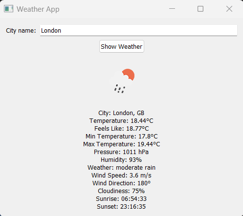

# Weather Application with OpenWeatherMap API

This application is a PyQt5-based program that fetches current weather information for a specified city using the OpenWeatherMap API.

## Requirements

- Python 3.x
- PyQt5
- requests library

## Installation

1. **Get Your API Key:**
   - You need an API key from OpenWeatherMap to run this application. You can obtain your API key for free from [OpenWeatherMap](https://openweathermap.org/).

2. **Install Dependencies:**
   ```bash
   pip install PyQt5 requests
   ```

3. **Run the Application:**
   ```bash
   python weather_app.py
   ```

## Usage

1. **Enter the City Name:**
   - Upon launching the application, enter the city name and click on the "Show Weather" button.

2. **View the Results:**
   - If you enter a valid city name, the application will display weather information and the weather icon. If the city is not found, you will receive an error message.

## Screenshots



## License

This project is licensed under the MIT License. For details, see the [LICENSE](LICENSE) file.
